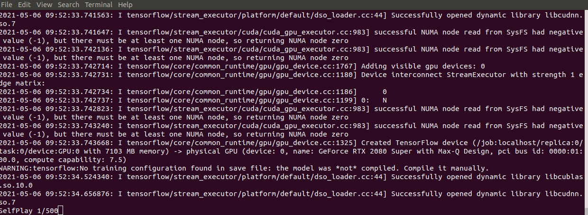

# 勉強用

## 簡易将棋の学習環境

1. dockerイメージ「doubutu-syougi_app:latest」がない場合は作成する<br>
    1.1 ```docker-compose up```もしくは```docker build -t doubutu-syougi_app:latest .```を実行
2. ```sh train.sh``` を実行<br>
3. 学習開始 <br>
